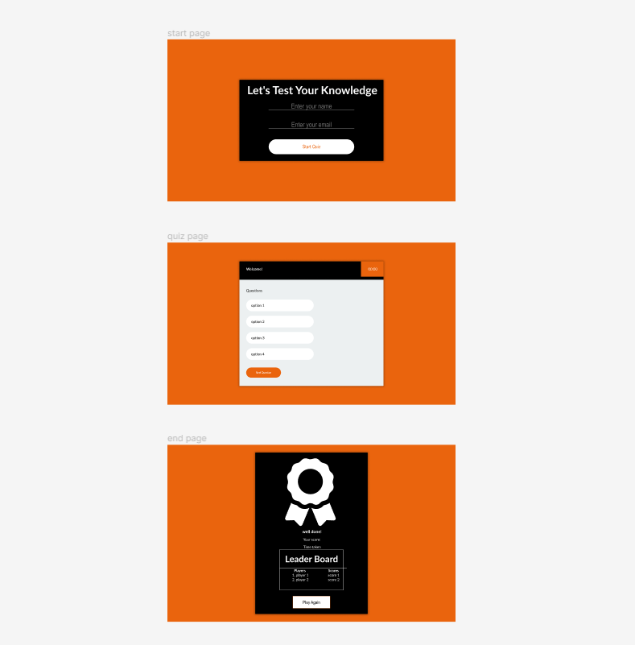

# ALX - Capstone Project

## Project Overview

 #### 1. Brief Description:

Welcome to QuizMaster, where learning meets excitement! Dive into a world of knowledge with our interactive quiz game. It's not just a game; it's a thrilling journey through various subjects, designed to make your learning experience as enjoyable as possible.

#### 2. Purpose and Goals:
Our mission is simple: to make learning a delightful adventure. That way we create an enjoyable and educational experience for users, while:

* Entertaining and Educating: Providing a fun platform for users to explore various subjects while learning new facts.
* Motivating and Challenging: Encouraging users to challenge themselves with different difficulty levels, boosting their confidence and knowledge.
* Fostering Community: Creating a sense of community through the leaderboard, allowing users to compete, compare, and learn from one another.

#### 3. Problem Solving and Value Proposition:

QuizMaster solves the challenge of making learning engaging by turning education into an interactive game. It adds value by:

* Enhancing Knowledge: Enabling users to expand their knowledge in a playful environment, making learning more engaging.
* Boosting Confidence: Allowing users to track progress and witness improvement, enhancing their confidence in their abilities.
* Building Community: Creating a friendly competitive atmosphere, fostering interaction and learning among users.

In essence, QuizMaster is a user-friendly, educational game that transforms learning into a fun, competitive, and interactive experience.

## Features and Functionality

#### 1. User verification:
To collect user's details for result display and for leaderboard.

#### 2. Multiple-Choice Questions:
Engaging multiple-choice questions challenge users’ knowledge. Each quiz is carefully crafted to be informative and fun, providing an enriching learning experience, covering a diverse range of subjects, from history and science to pop culture and current events.

#### 3. Leaderboard and Challenges:
QuizMaster fosters a sense of community. Users can compete with friends, join challenges, and see where they stand on the leaderboard. Friendly competition adds excitement and motivation.

 
## Technologies Used

#### Frontend Development:

HTML, CSS, JavaScript: Core technologies shaping the user interface and interactions.

#### Backend Development:

While HTML, CSS and JS technology were used for this project, the following would be considered as upgades are made:
Python: Powers backend logic, scripting, and server-side operations.
Flask Framework: Lightweight Python framework managing backend APIs, data, and requests.

 #### Database:

Data are stored temporally in the session storage, subsequent update would enable SQLAlchemy (SQL) connection for DBM.

 #### Web Services:

API: To provide question data and Facilitates seamless data exchange between frontend and backend.

 #### Version Control:

Git: Enables collaborative development and efficient codebase management.

 #### Development Tools:

Visual Studio Code: Integrated environment enhancing coding, debugging, and version control.

## Screenshots or Demo

_fig. 1: Flow Diagram with draw.io_

_fig. 2: Low Fidelity Prototypes with draw.io_

_fig. 3: High Fidelity Prototypes with Figma_

 [High Fidelity Prototypes with Figma](https://www.figma.com/file/kF0tH3hpaWHbna6z5zHDkO/Untitled?type=design&node-id=0%3A1&mode=design&t=FCvUuSDdqP4W8e09-1)

## Roadmap and future enhancements

* Expanded Question Variety: Diversify the quiz topics to offer a wider range of options for users.

* User-Created Quizzes: Enable users to create and share their quizzes, fostering a community-driven learning environment.

* Real-time Multiplayer Mode: Introduce live multiplayer mode, allowing users to compete in real-time against friends or random opponents.

* Optimized Performance: Enhance backend and frontend performance for faster loading and smooth user experience, especially on slow internet connections.

* Mobile Apps: Develop dedicated iOS and Android apps for convenient access via smartphones and tablets.

* Gamification: Implement badges and rewards to motivate users, encouraging regular participation.

* Accessibility: Ensure the application complies with accessibility standards, possibly making it usable for people with disabilities.

* Analytics: Integrate analytics for users to track their progress and performance over time.

* Social Sharing: Allow users to share quiz results on social media, expanding the app's reach.

* Multilingual Support: Provide quizzes in various languages, making the app inclusive for diverse audiences.

* Scalability: Architect the backend to handle increased users without compromising performance.

* Collaborative Learning: Add features like study groups and discussion forums to promote collaborative learning.

## Contact Information:

Feel free to reach out to me for any inquiries, or just to say hello! You can also connect with me on social media to stay updated on my latest projects and activities.

* Email: [martinsbuchi@gmail.com](martinsbuchi@gmail.com)
* LinkedIn: [linkedin.com/in/martinsugwu](linkedin.com/in/martinsugwu)
* GitHub: [https://github.com/martinsbuchi2](https://github.com/martinsbuchi2)
* Twitter: [twitter.com/martinsbuchie](twitter.com/martinsbuchie)
* Instagram: [instagram.com/martinsibuchim](instagram.com/martinsibuchim)

